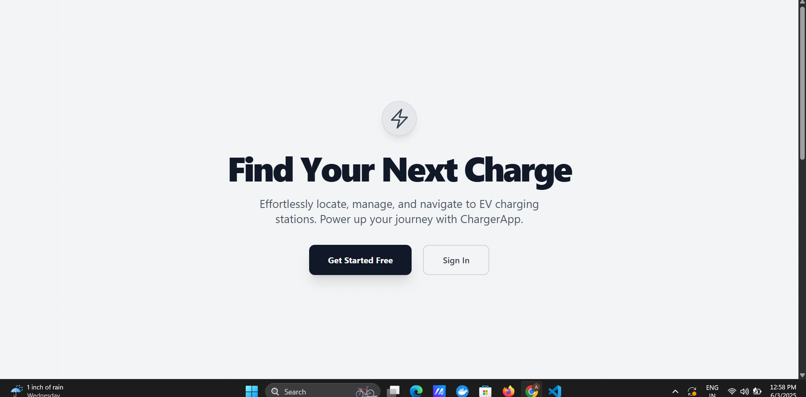
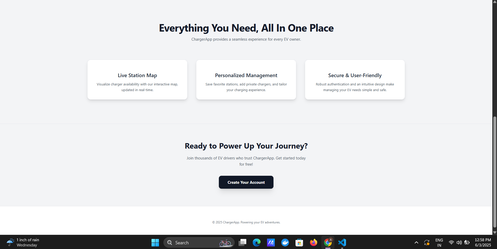
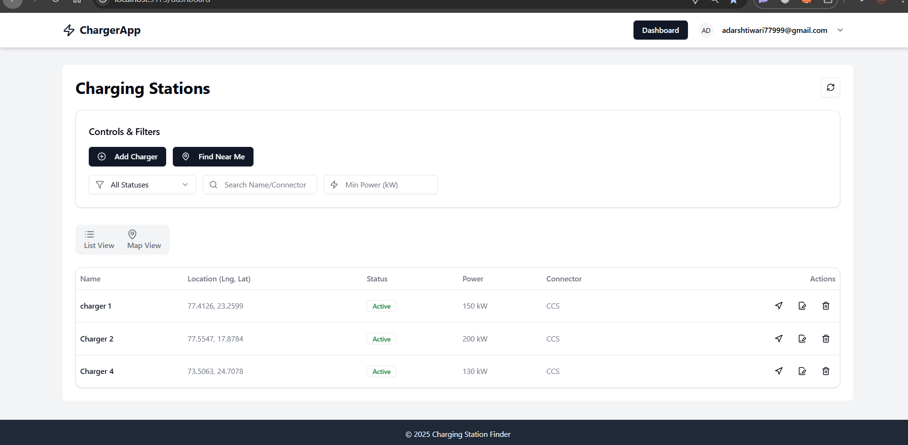
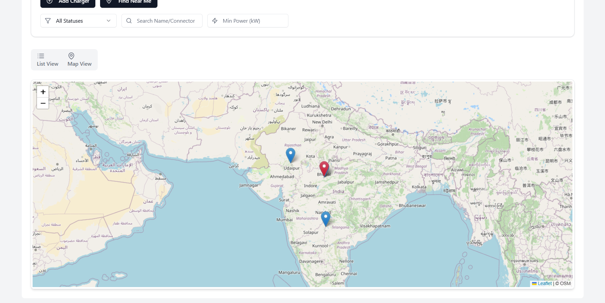
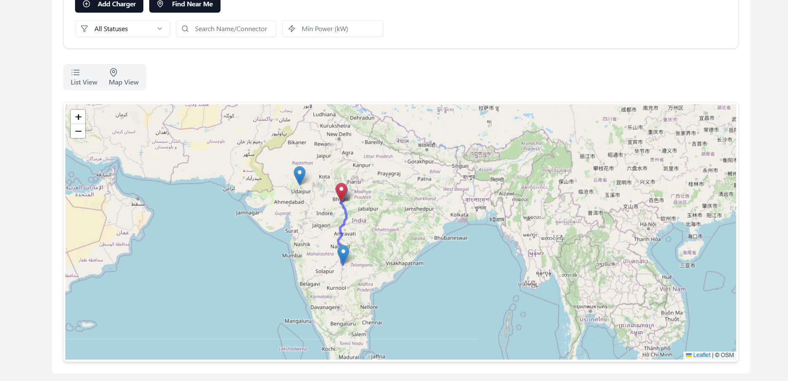

# EV Charging Station Management System

✨ Features

## 🔐 Authentication System
- **User Registration** - New user signup
- **User Login** - JWT-based authentication
- **Protected Routes** - Secure access to management features

## ⚡ Charging Station Management
- **Add New Station** - Create charging stations with complete details
- **View All Stations** - List all registered charging stations
- **Update Station Info** - Edit existing station details
- **Delete Stations** - Remove stations from the system

## 📊 Station Information Tracking
- **Station Name** - Unique identifier for each location
- **Geographic Location** - Latitude and longitude coordinates
- **Operational Status** - Active/Inactive status tracking
- **Power Specifications** - Power output in kW
- **Connector Types** - Different charging connector standards

## 🔍 Advanced Filtering & Search
- **Status Filter** - Show only active or inactive stations
- **Power Output Filter** - Filter by charging capacity (kW)
- **Connector Type Filter** - Filter by specific connector standards
- **Multi-criteria Filtering** - Combine multiple filters

## 🗺️ Interactive Map Features
- **Geographic Visualization** - All stations plotted on interactive map
- **Clickable Markers** - Tap/click markers for station details
- **Real-time Location Display** - Current station positions
- **Station Details Popup** - Quick info view on map interaction

## 🌐 Web Interface
- **Responsive Dashboard** - Modern Vue.js interface
- **Login Screen** - Clean authentication interface
- **Management Panel** - Comprehensive admin controls
- **Map Integration** - Google Maps or OpenStreetMap support

## 🔗 API Integration
- **RESTful APIs** - Standard HTTP methods for all operations
- **Real-time Data** - Live synchronization between frontend and backend
- **Cross-platform Access** - APIs accessible for future mobile apps

## ☁️ Cloud Deployment
- **Live Application** - Deployed and accessible online
- **Public API Endpoints** - Available for testing and integration
- **Scalable Infrastructure** - Cloud-based hosting

## 🚀 Quick Start

### Prerequisites
- Node.js 18.0 or higher
- npm 8.0 or higher
- MongoDB 5.0 or higher

### Installation

1. **Clone the repository**
```bash
git clone https://github.com/Adarshtiwarikrai/Evoltsoft.git
cd Evoltsoft
```

2. **Install frontend dependencies**
```bash
cd vue_project
npm install
```

3. **Install backend dependencies**
```bash
cd ../backend
npm install
```

4. **Environment setup**
I have provided all the Environment variables for clean setup - use them

5. **Start the application**
```bash
# Development mode (runs both backend and frontend)
npm run dev

# Or start them separately
node server.js   # Backend only
npm run dev      # Frontend only
```

6. **Open your browser**
Navigate to http://localhost:5174

## 📸 Screenshots

### Home Screen



### Dashboard Overview


### Interactive Map View

-Red-icon:-User Location
-Blue-icon:-Station Location

### Route Overview

-Red-icon:-User Location
-Blue-icon:-Station Location
## 📖 Usage

### Getting Started with Your EV Charging Network

1. **Sign up for a new account or login with the demo credentials:**
   - Email: demo@evcharger.com
   - Password: demo123

2. **Add your first charging station:**
   - Click "Add Charger" on the dashboard
   - Fill in the station details:
     - Name: Downtown Mall Charger
     - Location: Use the map picker or enter coordinates
     - Status: Active
     - Power Output: 50 kW
     - Connector Type: CCS Type 2

3. **View all charging network:**
   - You will see all the chargers that are available in list view
   - Use filters to find specific stations by status, power, or connector type
   - Edit station details using the edit icon
   - Delete stations that are no longer in service
   - Switch to "Map View" to see geographic distribution
   - When you click on the station marker, the popup will appear that shows station details
   - In popup there are two buttons: "Find Directions" and "Show Route"
     - When you click on "Find Directions" it shows the directions from your location to that station in Google Maps
     - When you click "Show Route" it shows direction in the current map

4. **Find closest station**
   - Click the "Find Near Me" button on dashboard - it will show the nearest station to current user location
   - It will show the nearest station to user location and in map view when we click on the station marker in map it will show two buttons:
     - "Find Direction" to find direction from the user location to station in Google Maps
     - "Show Route" button to show the route in current map

## 🏗️ Project Structure

```
Evoltsoft/
├── vue_project/                 # Frontend Vue.js application
│   ├── public/
│   │   ├── index.html
│   │   ├── favicon.ico
│   │   └── screenshots/         # Application screenshots
│   │       ├── login-screenshot.png
│   │       ├── dashboard-screenshot.png
│   │       ├── station-management-screenshot.png
│   │       ├── map-view-screenshot.png
│   │       ├── add-station-screenshot.png
│   │       └── mobile-view-screenshot.png
│   ├── src/
│   │   ├── assets/              # Static assets like images, global CSS
│   │   │   └── logo.png
│   │   ├── components/          # Reusable UI components
│   │   │   ├── Navbar.vue
│   │   │   ├── ChargerForm.vue
│   │   │   └── ChargerMap.vue
│   │   ├── router/              # Vue Router configuration
│   │   │   └── index.js
│   │   ├── services/            # API interaction logic
│   │   │   ├── apiClient.js
│   │   │   └── stationService.js
│   │   ├── store/               # Vuex state management
│   │   │   ├── index.js
│   │   │   └── modules/
│   │   │       ├── auth.js
│   │   │       └── stations.js
│   │   ├── views/               # Page-level components
│   │   │   ├── LoginView.vue
│   │   │   ├── RegisterView.vue
│   │   │   ├── DashboardView.vue
│   │   │   └── NotFoundView.vue
│   │   ├── App.vue              # Root Vue component
│   │   └── main.js              # Main entry point
│   ├── .env                     # Environment variables
│   ├── babel.config.js
│   ├── package.json
│   └── vue.config.js            # Vue configuration
│
├── backend/                     # Node.js backend
│   ├── controllers/             # Route handlers
│   ├── models/                  # Database models
│   ├── middleware/              # Express middleware
│   ├── routes/                  # API routes
│   ├── utils/                   # Helper functions
│   ├── config/                  # Configuration files
│   ├── .env                     # Environment variables
│   ├── package.json
│   └── server.js                # Main server file
│
├── README.md                    # Project documentation
└── .gitignore                   # Git ignore file
```
